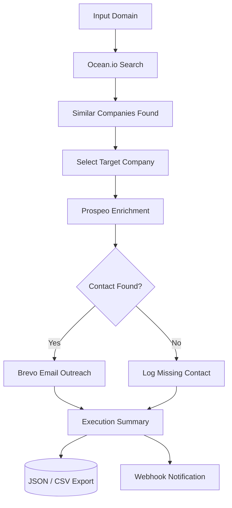

<p align="center">

</p>

<div align="center">


</div>

<div align="center">


</div>

<div align="center">


</div>

<div align="center">

<a href="https://github.com/Xatyam07/vocallabs-outreach">

</a>
<a href="#-api-endpoints">

</a>

</div>

<br>

> Vocallabs Outreach Automation is a Node.js-based lead generation and outreach automation system that integrates Ocean.io, Prospeo, and Brevo into a single automated pipeline. It accepts a company domain as input, discovers similar companies, enriches contact information, and performs automated outreach through email — built as part of the Vocallabs Software Development Internship Assignment.

---

## 📑 Table of Contents

- [Features](#-features)
- [Workflow](#-workflow)
- [Tech Stack](#-tech-stack)
- [Project Structure](#-project-structure)
- [Installation](#-installation)
- [Environment Variables](#️-environment-variables)
- [API Endpoints](#-api-endpoints)
- [Sample Response](#-sample-response)
- [Assignment Notes](#-assignment-notes)
- [Roadmap](#-roadmap)
- [Author](#-author)
- [License](#-license)

---

## 🚀 Features

<table>
<tr>
<td width="50%">

**🔍 Company Discovery**
- Search similar companies via Ocean.io
- Dynamic domain input support
- Automatic target company selection

</td>
<td width="50%">

**📇 Contact Enrichment**
- Find contact information via Prospeo
- Retrieve email addresses and prospect details
- Graceful handling of missing contacts

</td>
</tr>
<tr>
<td width="50%">

**✉️ Email Automation**
- Automated outreach emails via Brevo
- Customizable email templates
- End-to-end outreach workflow

</td>
<td width="50%">

**⚙️ Backend Architecture**
- REST API built with Express.js
- Modular, service-based structure
- Environment-based configuration
- Centralized error handling and logging

</td>
</tr>
</table>

### ✨ Extra Engineering Touches

> A few enhancements added beyond the base assignment scope to make the pipeline more production-ready.

- 🧠 **Lead Scoring** — basic heuristic score per company (size, domain match strength, contact confidence)
- 🔁 **Retry and Rate-Limit Handling** — automatic retries with backoff for Ocean.io / Prospeo / Brevo calls
- 📊 **JSON and CSV Execution Summaries** — export pipeline runs for reporting
- 🪵 **Structured Logging** — request and pipeline-stage logs for easier debugging
- 🔔 **Webhook Notification on Completion** — optionally POST a summary to a configured webhook URL
- 🐳 **Docker Support** — containerized for consistent local/dev environments
- 📬 **Postman Collection** — ready-to-import collection for testing all endpoints

---

## 🔄 Workflow



---

## 🛠️ Tech Stack

<div align="center">


</div>

| Category | Technology |
|-----------|------------|
| Backend | Node.js, Express.js |
| APIs and Services | Ocean.io, Prospeo, Brevo |
| Libraries | Axios, Dotenv, CORS |
| Logging | Winston (or console-based structured logs) |
| Containerization | Docker (optional) |

---

## 📂 Project Structure

```bash
vocallabs-outreach/
│
├── data/
│   └── leads.json
│
├── routes/
│   ├── outreach.js
│   └── email.js
│
├── services/
│   ├── ocean.js
│   ├── prospeo.js
│   ├── brevoService.js
│   └── hunter.js
│
├── utils/
│   ├── logger.js
│   └── retry.js
│
├── .env
├── server.js
├── package.json
├── package-lock.json
└── README.md
```

---

## 📥 Installation

### 1. Clone the repository

```bash
git clone https://github.com/Xatyam07/vocallabs-outreach.git
cd vocallabs-outreach
```

### 2. Install dependencies

```bash
npm install
```

### 3. Configure environment variables

See [Environment Variables](#️-environment-variables) below.

### 4. Start the server

```bash
node server.js
```

Server runs on:

```text
http://localhost:5000
```

### Optional: Run with Docker

```bash
docker build -t vocallabs-outreach .
docker run -p 5000:5000 --env-file .env vocallabs-outreach
```

---

## ⚙️ Environment Variables

**`.env`**

```env
PORT=5000

OCEAN_API_KEY=your_ocean_api_key
PROSPEO_API_KEY=your_prospeo_api_key
BREVO_API_KEY=your_brevo_api_key

# Optional - extra features
WEBHOOK_URL=your_webhook_url
LOG_LEVEL=info
```

---

## 🔌 API Endpoints

| Method | Endpoint | Description |
|--------|----------|--------------|
| `GET` | `/` | Health check |
| `GET` | `/test-email` | Test email delivery through Brevo |
| `GET` | `/test-ocean` | Test Ocean.io company discovery |
| `GET` | `/test-prospeo` | Test contact enrichment through Prospeo |
| `GET` | `/run-pipeline?domain=hubspot.com` | Run the full discovery → enrichment → outreach pipeline |

### Health Check

```http
GET /
```

```json
{
  "success": true,
  "message": "Vocallabs Outreach API Running"
}
```

### Run Full Pipeline

```http
GET /run-pipeline?domain=hubspot.com
```

---

## 📋 Sample Response

```json
{
  "success": true,
  "message": "Pipeline executed successfully",
  "summary": {
    "inputDomain": "hubspot.com",
    "companiesFound": 10,
    "selectedCompany": "wthubspot.com",
    "contactFound": false,
    "emailReady": false
  }
}
```

---

## 📝 Assignment Notes

- Implemented Ocean.io integration for company discovery
- Implemented Prospeo integration for contact enrichment
- Implemented Brevo integration for email outreach
- Added dynamic domain input support
- Added automatic target company selection
- Added execution summary response
- Added error handling for missing contacts
- Built modular and reusable service architecture

### Note About Eazyreach

According to the assignment FAQ provided by Vocallabs, Eazyreach credits were unavailable. Therefore, Prospeo was used as the alternative solution for contact discovery and enrichment.

---

## 🔮 Roadmap

- [ ] Frontend dashboard
- [ ] Database integration (lead history, dedupe)
- [ ] Bulk domain processing
- [ ] Automated campaign tracking
- [ ] CRM integration (HubSpot, Salesforce)
- [ ] Scheduled outreach campaigns (cron-based)
- [ ] Lead scoring model v2 (weighted, configurable)
- [ ] Multi-channel outreach (LinkedIn, follow-up sequences)

---

## 👨‍💻 Author

<div align="center">

### Satyam Mishra
B.Tech Computer Science Engineering, PSIT Kanpur

<a href="https://github.com/Xatyam07">

</a>
<a href="https://satyam07portfolio.vercel.app">

</a>

</div>

---

## 📄 License

This project was developed as part of the Vocallabs Software Development Internship Assignment and is intended for educational and demonstration purposes.

---

<div align="center">

⭐ If you found this project interesting, consider giving it a star!


</div>
